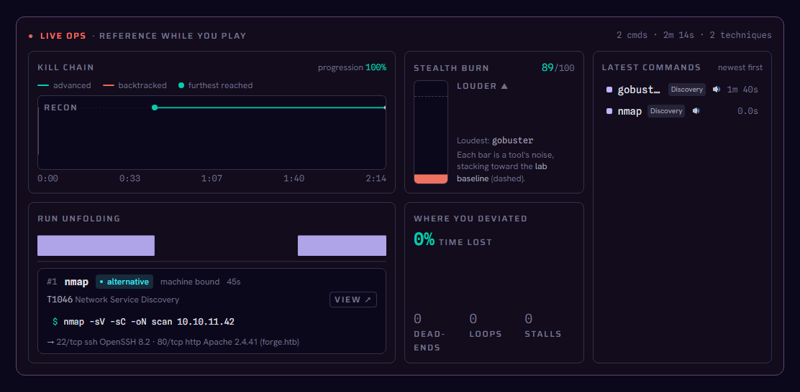
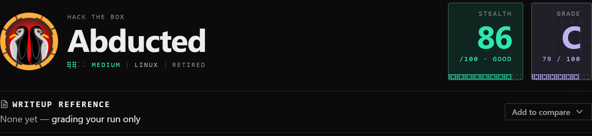
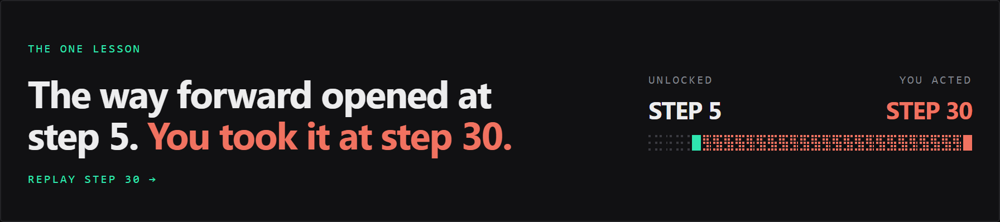
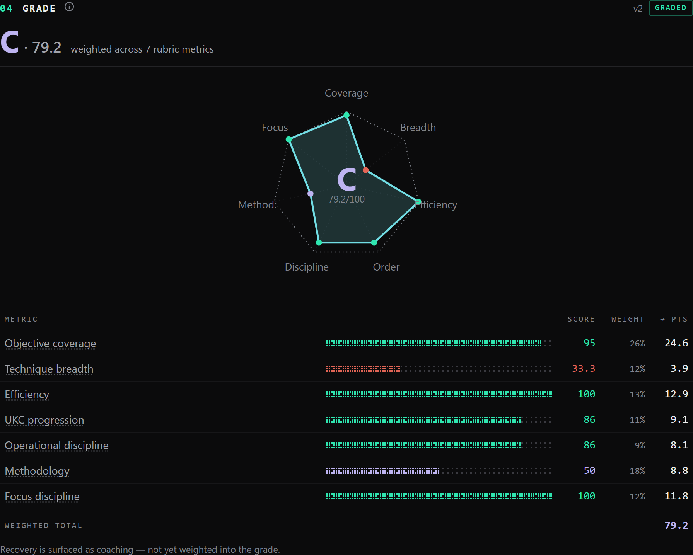
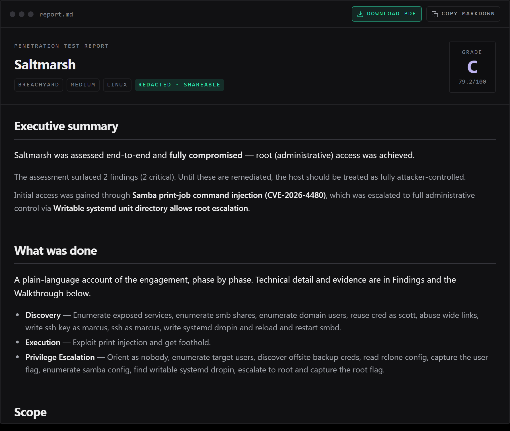
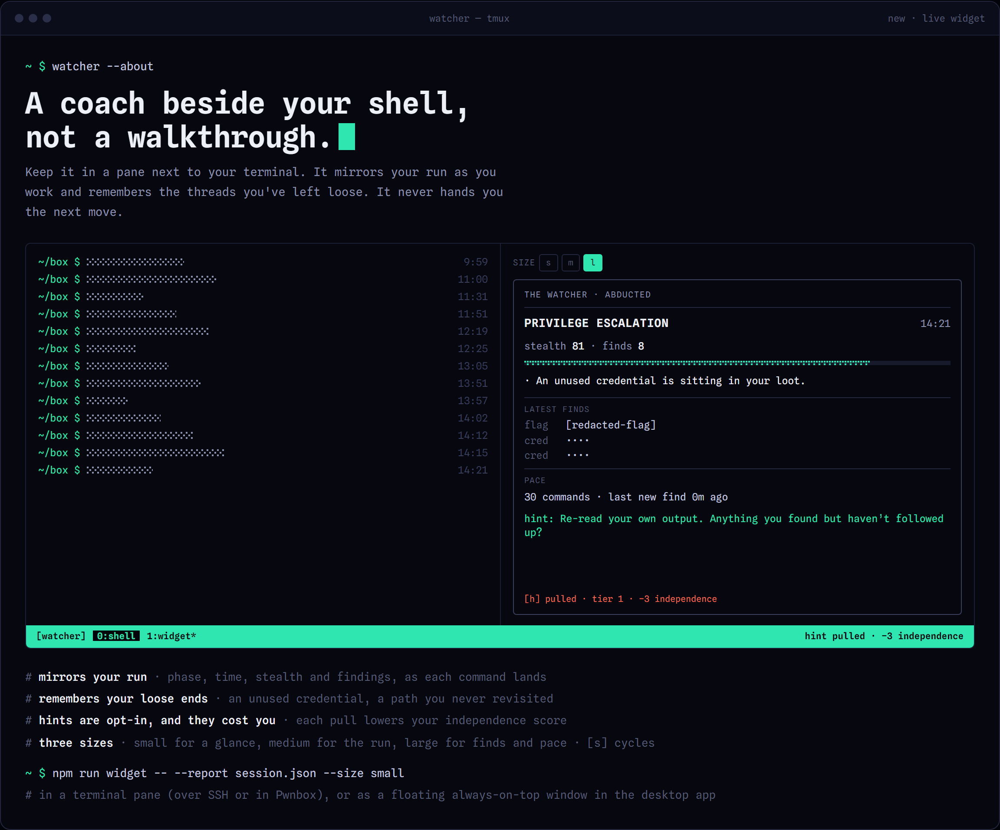

<div align="center">

<picture>
  <source media="(prefers-color-scheme: dark)" srcset="docs/brand/owlsh-dark.svg">
  
</picture>

# owlsh

**A local-first flight-data-recorder for security practice.**

Record your run against any box, then get a graded debrief: what you achieved, where you wasted time, and the one thing to fix next. Now grades defenders, too.

<sub>Formerly <b>The Watcher</b>. Existing sessions, settings and plugins carry over automatically.</sub>

**[owlsh.com](https://owlsh.com)** · [Features](#features) · [Install](#install) · [Usage](#usage) · [How it works](#how-it-works) · [Testing](TESTING.md)

</div>

<p align="center">
  
</p>

<table>
  <tr>
    <td width="50%"><br><b>The verdict</b> — one grade for the whole run, with stealth scored alongside.</td>
    <td width="50%"><br><b>The one lesson</b> — the single highest-value fix, linked to the exact step it happened.</td>
  </tr>
  <tr>
    <td width="50%"><br><b>A grade you can defend</b> — seven weighted metrics across ATT&amp;CK, the Kill Chain and CWE.</td>
    <td width="50%"><br><b>The report writes itself</b> — an OSCP/CPTS-style write-up with a CISO summary, exported as Markdown or PDF. <a href="https://owlsh.com/assets/owlsh-sample-report-abducted.pdf">Sample PDF</a>.</td>
  </tr>
  <tr>
    <td colspan="2"><br><b>A coach beside your shell</b> — the live widget mirrors your run in a tmux pane and flags loose ends. Hints are opt-in and cost you independence.</td>
  </tr>
</table>

---

owlsh records the commands you run against a target — on Hack The Box, TryHackMe, OffSec, Immersive Labs, or a local CTF — and turns the run into a graded debrief. Every run is read through three frameworks at once: **MITRE ATT&CK** (*what* you did), the **Unified Kill Chain** (the *order*, so backtracking is measurable), and **CWE** (the *weakness class*, so SQLi and XXE count as two skills). Everything runs on your machine — no account, no telemetry, no cloud.

## Features

- **Graded debrief, per phase** — a Lighthouse-style audit across ATT&CK, the Kill Chain and CWE, ending in an explainable letter grade.
- **The one lesson** — the single highest-value fix for next time, deep-linked to the exact step.
- **Live Ops** — kill-chain position, stealth burn and a next-move nudge, streaming as you work.
- **The Ghost** — the optimal line derived from *your own* findings: where you went ahead, off-path, or pivoted too late. With no write-up it still flags what your run proves you missed (a credential found but never used, an access opened but never audited, a faster root you walked past).
- **Any capture source** — a userspace PTY agent (no eBPF/ptrace/kernel hooks), plus import of a Claude Code transcript, a Burp/ZAP HAR, or a Sysmon/EDR log.
- **Grade defenders, too** — pair an attacker capture with an analyst's investigation and score the response.
- **Progress across runs** — grade, coverage and methodology charted over your history.
- **Local-first** — deterministic scoring; an optional local (Ollama) or opt-in cloud model only sharpens the wording, never the numbers.

## Install

**Desktop app** — grab the installer for your OS from the **[latest release](https://github.com/silofy/owlsh/releases/latest)** (`.dmg`, `.msi`/`.exe`, `.AppImage`/`.deb`/`.rpm`). Builds aren't signed yet: on macOS right-click → **Open**, on Windows SmartScreen → **More info** → **Run anyway**. Each release lists `SHA256SUMS` to verify a download.

### Capture agent

One static binary (musl), no Rust toolchain, no runtime deps — it runs on Kali, Parrot and HTB Pwnbox alike. Install it one of three ways:

```sh
# 1. One-line installer — downloads the prebuilt binary, verifies it against SHA256SUMS, installs to ~/.local/bin
curl -fsSL https://raw.githubusercontent.com/silofy/owlsh/main/install.sh | sh    # Kali · Parrot · Pwnbox · macOS
irm https://raw.githubusercontent.com/silofy/owlsh/main/install.ps1 | iex         # Windows
```

```sh
# 2. Debian package — grab owlsh_<ver>_amd64.deb (or _arm64.deb) from the latest release:
#    https://github.com/silofy/owlsh/releases/latest
sudo dpkg -i owlsh_*.deb
```

```sh
# 3. apt (once the signed repo is published — see packaging/apt/)
curl -fsSL https://silofy.github.io/watcher-apt/watcher-archive-keyring.asc | sudo tee /usr/share/keyrings/owlsh.asc >/dev/null
echo "deb [signed-by=/usr/share/keyrings/owlsh.asc] https://silofy.github.io/watcher-apt stable main" | sudo tee /etc/apt/sources.list.d/owlsh.list
sudo apt update && sudo apt install owlsh
```

Then capture, which differs by where you're working:

- **Kali or Parrot (your own VM, over VPN)** — capture live; each command streams straight into the desktop app:

  ```sh
  owlsh --attach --platform htb --target <box>
  ```
  If `~/.local/bin` isn't on your `PATH`, the installer prints the one line to add it. Add `--web` to fold in Burp traffic (see [Usage](#usage)).

- **HTB Pwnbox (cloud)** — the browser-streamed VM has no local desktop app, so install the agent *inside* Pwnbox, capture to a file, and open it on your own machine:

  ```sh
  owlsh --export ~/.owlsh-exports/run.json --platform htb --target <box>
  ```
  Then drop `run.json` into **History → Import session** in the app (it can also pull the file over SSH automatically — the setup wizard walks you through it).

**Just look at a report** — no install: open the [live demos](#demos), or `npm install && npm run dev` → <http://localhost:5173>.

**Build from source** — `npm run doctor` (checks Rust + platform libraries and prints any fix), then `npm run tauri dev`. Needs Node 20+ and Rust. Full walkthrough: **[TESTING.md](TESTING.md)**.

## Demos

Two real runs you can watch build live in your browser, no install — transcribed from public write-ups, flags and credentials redacted:

- **[HTB Abducted](https://silofy.github.io/watcher-demos/?demo=abducted)** (medium) — Samba print-job RCE → `rclone` creds → wide-links pivot → writable systemd drop-in to root.
- **[THM RootMe](https://silofy.github.io/watcher-demos/?demo=rootme)** (easy) — upload-filter bypass to a `www-data` shell → SUID-python GTFOBins jump to root.

## The debrief

When the run ends, the live panel settles into a single-column, lesson-first report: the verdict, then the one thing to fix, then the detail — so "what do I do differently next time" is answered before you scroll. [See it in the demo ▶](https://silofy.github.io/watcher-demos/?demo=abducted)


## Usage

With the [capture agent](#install) installed, record a run (it streams into the app live; type `exit` to stop):

```sh
owlsh --attach --platform htb --target <box>   # --platform: htb | thm | offsec | immersive | local
```

owlsh grades a run from any of these sources too — each feeds the same engine and is tagged by source in the debrief. Use the CLI, or **History → Import session** in the app (or drag a file onto it):

| Source | Command |
| --- | --- |
| Terminal (PTY) | `owlsh --attach --platform htb --target <box>` |
| Claude Code transcript | `npm run ingest:claude-code -- --transcript <session.jsonl>` |
| HTTP proxy (HAR) | `npm run ingest:http-proxy -- --har <capture.har>` |
| Sysmon / EDR | `npm run ingest:sysmon -- --events <sysmon.json>` |
| Defensive investigation | `npm run ingest:defense -- --incident <attacker capture> --run <analyst session>` |

A run imported without a write-up is graded against a canonical methodology ladder (host or web), so coverage is meaningful rather than zero. The **defensive** run uses the attacker capture as the answer key and scores five metrics: Coverage, Reconstruction, Time-to-detect, Scoping and Discipline.

**Live widget** — a compact companion to keep in a pane beside your shell (e.g. a tmux split). It mirrors your run as you work — phase, elapsed time, stealth, findings — and flags your own loose threads (an unused credential, a path you never revisited) or a long run with little to show. It never tells you the next move: hints are opt-in (`h`), escalate one tier at a time, and each pull costs independence.

```sh
npm run widget -- --report <session.json> --size medium   # small | medium | large; [s] cycles, [h] hint, [q] quit
```

In the desktop app, click **Widget** in the header for the same view as a small, always-on-top window you can park beside your terminal. It follows your newest capture, and hints you pull there are recorded the same way. Three sizes: **small** (phase and one line), **medium** (stats and your open threads), **large** (adds your latest finds and pace) — switch with S/M/L in its header or the `s` key.

**Draft a report** — turn a graded run into an OSCP/CPTS-style Markdown report (findings with severity, evidence, reproduction and remediation), deterministic and offline:

```sh
npm run report                      # the bundled demo → dist/report.md
npm run report -- --report <path>   # from your own report JSON
```

**Web traffic (optional)** — with **Burp Suite** and its **MCP Server** extension running, add `--web` to any capture to fold HTTP attacks (SQLi → CWE-89, IDOR → CWE-639, traversal → CWE-22) onto the same timeline. Off by default, in-scope traffic only, with auth headers/cookies/tokens stripped before anything is stored. Full setup: **[docs/web-capture.md](docs/web-capture.md)**.

**Pwnbox** (no local terminal to watch)? Install the agent there and capture to a file the app pulls over SSH: `owlsh --export ~/.owlsh-exports/run.json --platform htb --target <box>`. Full capture guide: **[crates/capture/CAPTURE.md](crates/capture/CAPTURE.md)**.

## How it works

A small Rust agent captures your shell through a normal PTY (ConPTY on Windows, openpty on Unix) — **no eBPF, ptrace, or kernel hooks**. The capture is processed **deterministically** (segmentation, MITRE tagging, golden-path diff, metrics) into one versioned JSON report (`schema/owlsh-report.schema.json`) that the UI renders. An optional model — local Ollama or an opt-in cloud model — only sharpens the coaching text, never the numbers. A run saved to the optional encrypted store can be rebuilt into the same report ([docs/store-report.md](docs/store-report.md)).

## Privacy

By default your session never leaves the machine, and redaction runs before anything hits disk. Two opt-in paths make outbound requests, each by your action: fetching a write-up you asked for, and — only if you pick a **cloud** coaching model over the local one — sending that model your commands, redacted first (IPs, creds, flags stripped). Rules-based and local (Ollama) coaching stay fully offline; API keys and tokens are stored only on your machine. More in **[TESTING.md](TESTING.md)**.

## License

[AGPL-3.0](LICENSE). Use, study and modify owlsh freely; if you distribute a modified version, or run one as a network service, publish your changes under the same license.
